# Software Programming II - Jarvis
#### Authors: *Brian Alin Monoranu (20318381), Oskar Jasiewicz (20377563), Nikita Dmitriev (20204397)*

## Contents

1. Overview
   1. Motivation
   2. Development Tools
   
2. Game Instructions
   1. Console Mode
   2. Using Graphical Interface

## Overview

### Motivation
This Java program was developed as part of a group project for
Software Engineering II in UCD Stage 2.
The goal of the project was to implement a game of Blokus Duo according to
[these rules](https://service.mattel.com/instruction_sheets/FWG43-Eng.pdf).

### Development Tools

- IntelliJ IDEA 2021.3.1 (Community Edition)
- Java 17 SDK
- libGDx v1.10
- Tiled Map Editor Version 1.8.2
- GitHub *(obviously)*

## Game Setup Instructions
Though user will be prompted throughout the game, here are the brief description of the designated
user input. 

When starting the game via command prompt: `$ java -jar Jarvis.jar`, you can specify the following:

- starting player's symbol as the first argument, `-X` or `-O`
- .txt file with user input for testing purposes `<filename.txt`
- `-gui` if you want to use graphical UI instead of regular text one.

### Console Mode

As console input needs a pivot point to place each piece,
you can find reference in the picture below.

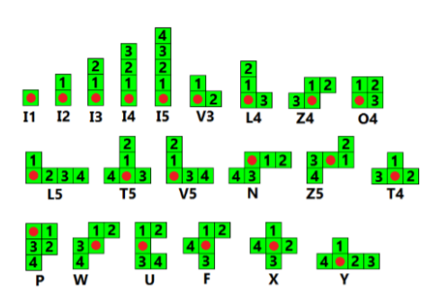

1. Enter players' names. They can only contain low and upper case letters
of latin alphabet.
   
   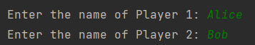

2. Read the rules.

    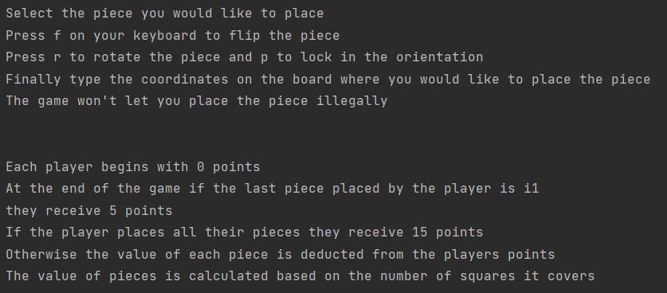

3. Before each move user will be shown the board with possible placement points marked with *.
Below it user will be shown pieces available to the players.

    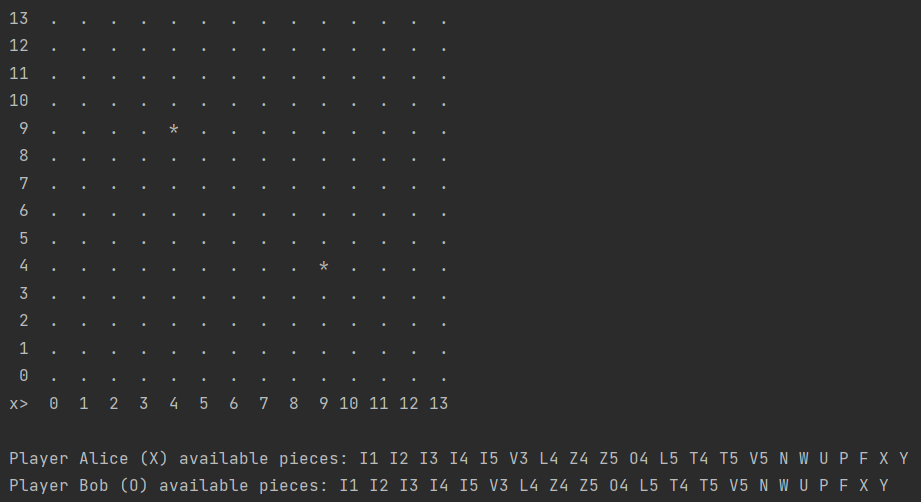

4. The mentioned player needs to input the type of shape they want to place.
   They then will be shown how it will be positioned on the board.

   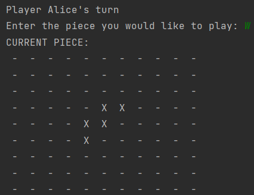

5. Keep typing 'r' or 'f' to rotate the shape 90* clockwise or flip along the vertical axis respectively.

   Rotation

   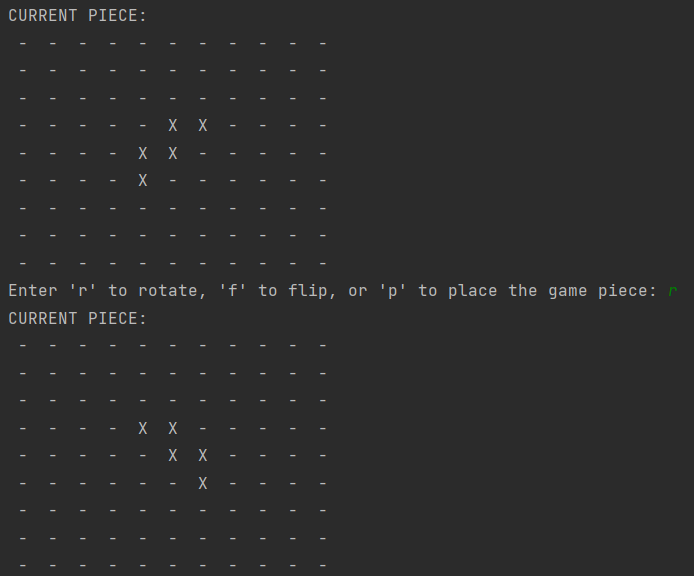

   Flipping

   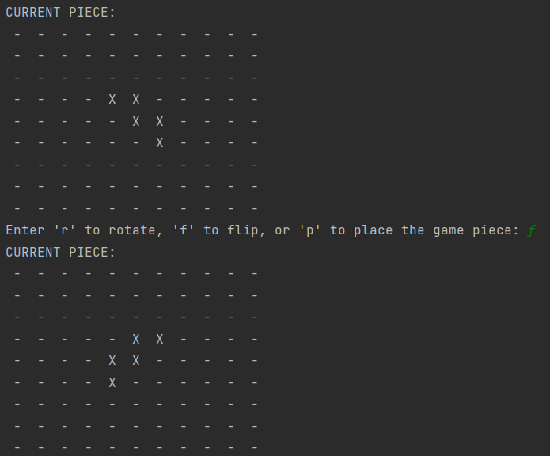

6. After deciding on final state of the shape, type 'p' and enter
   coordinates of the pivot point. See the result of your shape on the game board.

   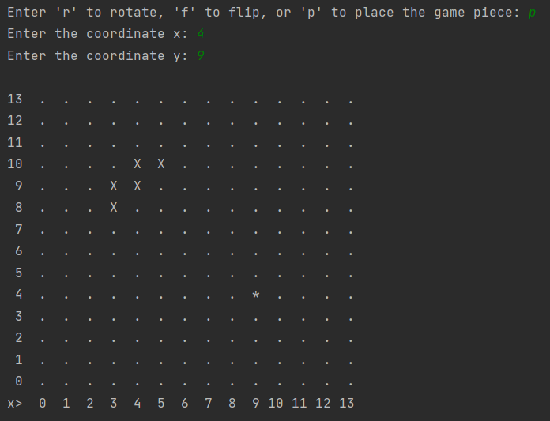

7. Repeat steps 3-5 until no-one can place any pieces.

8. When no one can place a piece, game will calculate and display your score

### Using Graphical Interface

1. Enter players' names. They can only contain low and upper case letters
   of latin alphabet. Use button in the bottom left corner to go to the settings menu.

   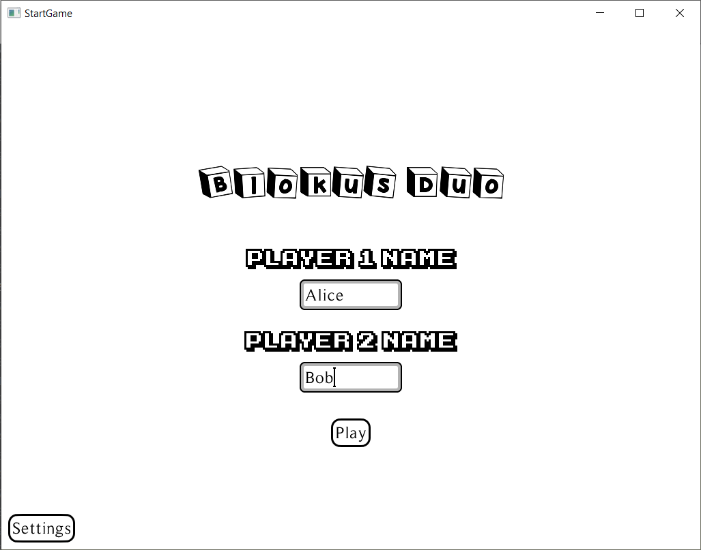

2. In the settings screen:
   1. Choose color of the players' pieces by dragging sliders 
   to adjust RGB values of the color;
   2. Press Music button to turn on the music that will accompany you along the game;
   3. Adjust the volume and change the song if you want;
   4. Change color of the text and background by repeatedly clicking on
   Change Game Colour button.

   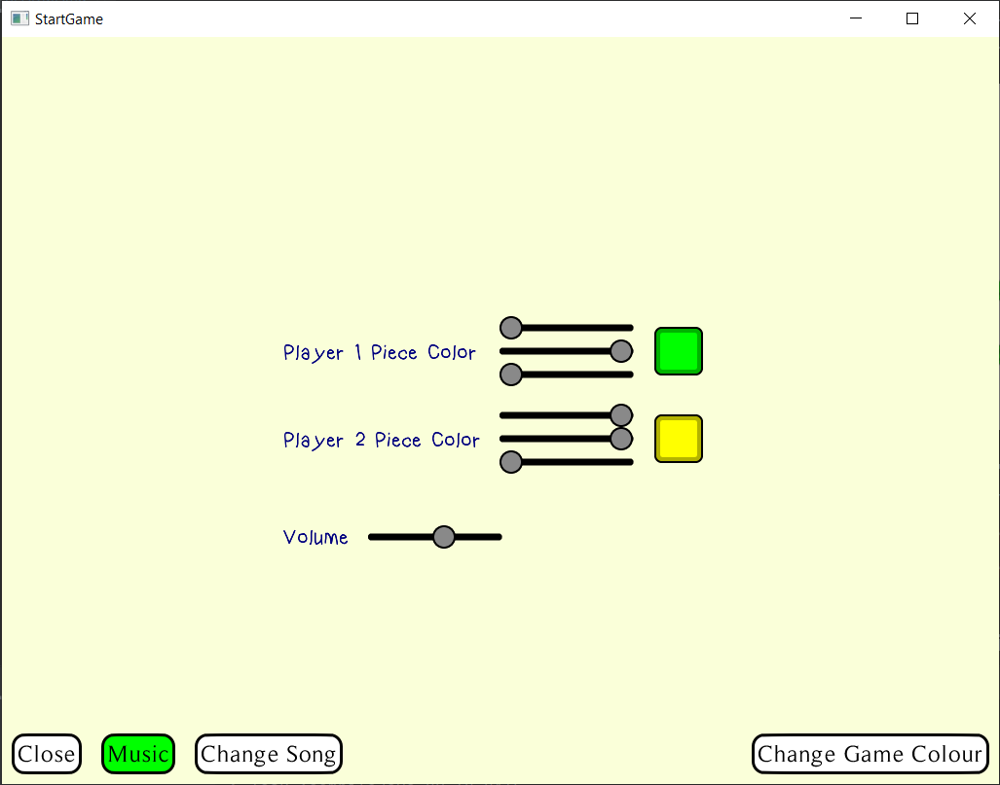

3. Before the game starts, you will be shown how to play the game and how
the winner is determined. Wait for the assets to load and press Start the Game.

   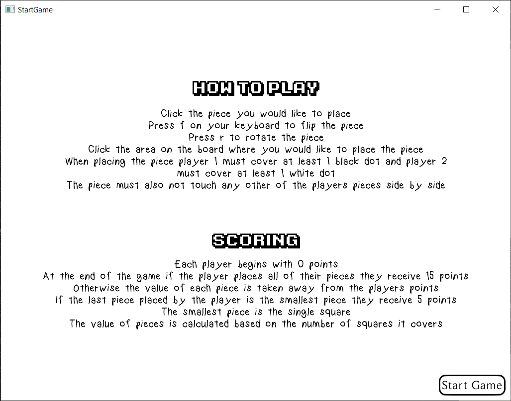

4. Before each move dialog will show whose turn is it.
If next player cannot make a move according to the game rules, that will be told as well.

   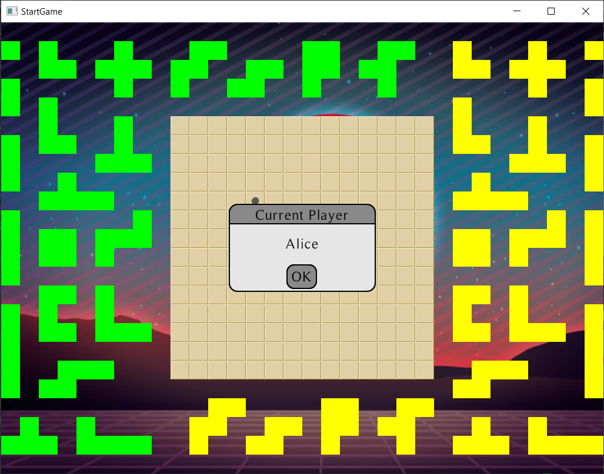

   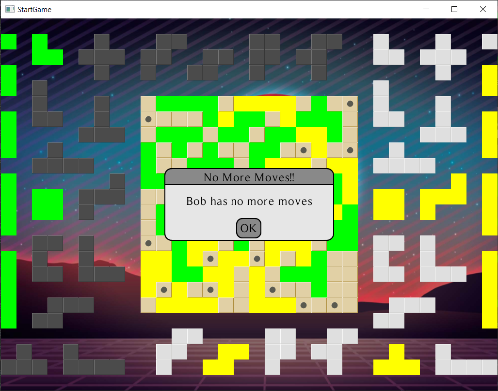

5. Press and drag the needed piece. Keys "R" and "F" of the keyboard will
rotate and flip the piece respectively. Right-click do drop the current piece.
Press with the piece over the board to place it (if you can).

   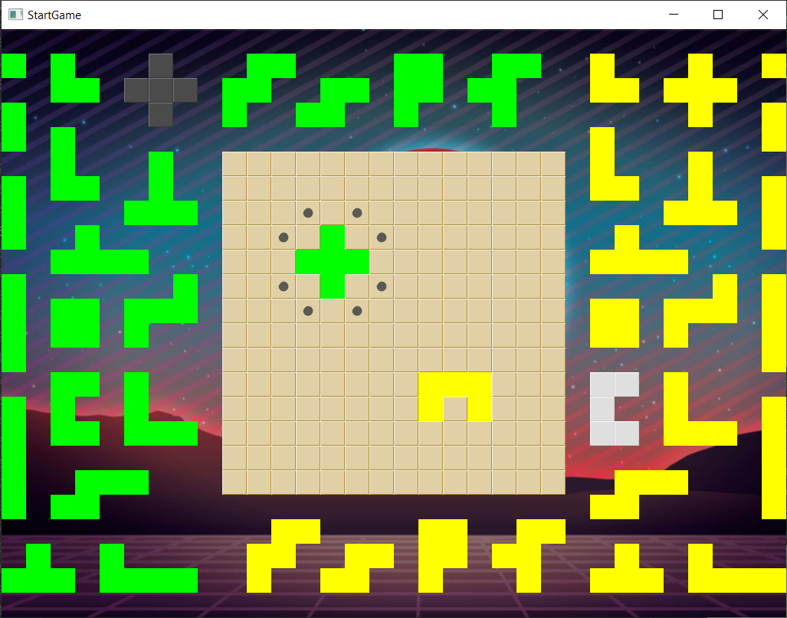

6. If no one can make a move, the games finishes. Players will be shown their
scores. Yes, score can be negative.

    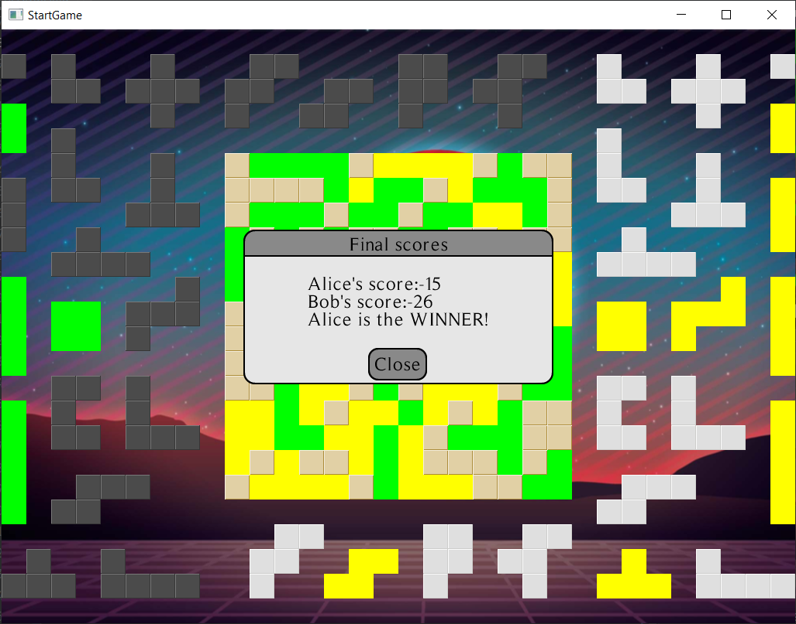